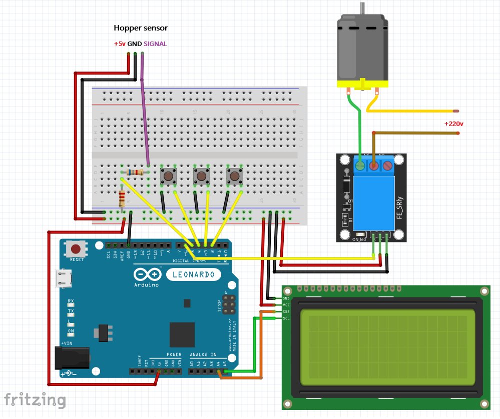
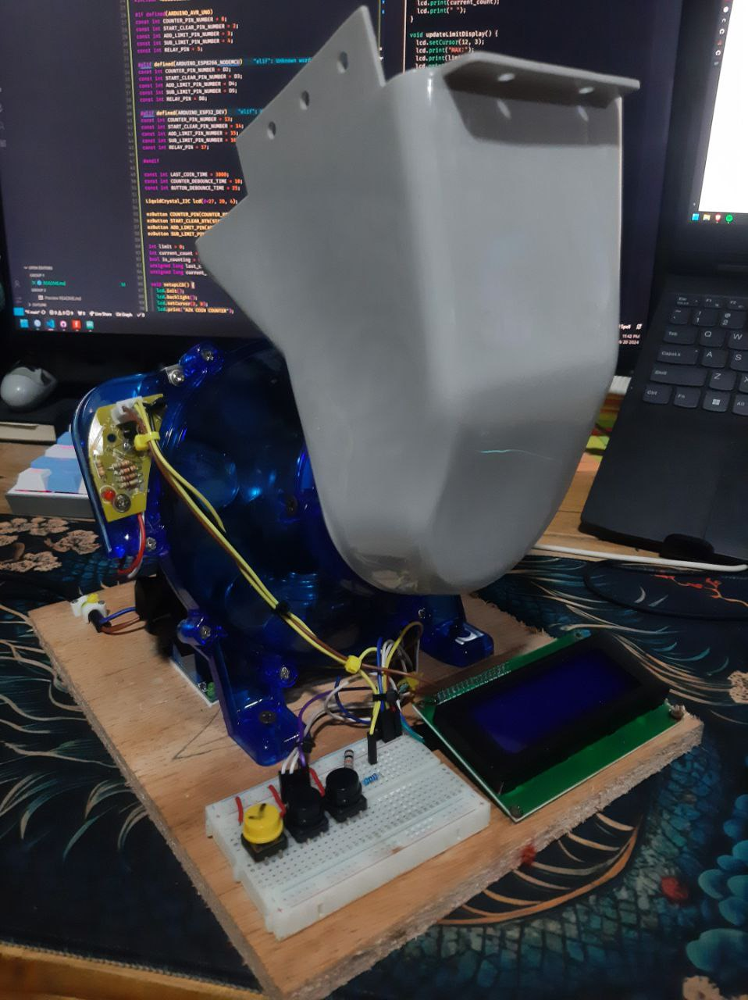
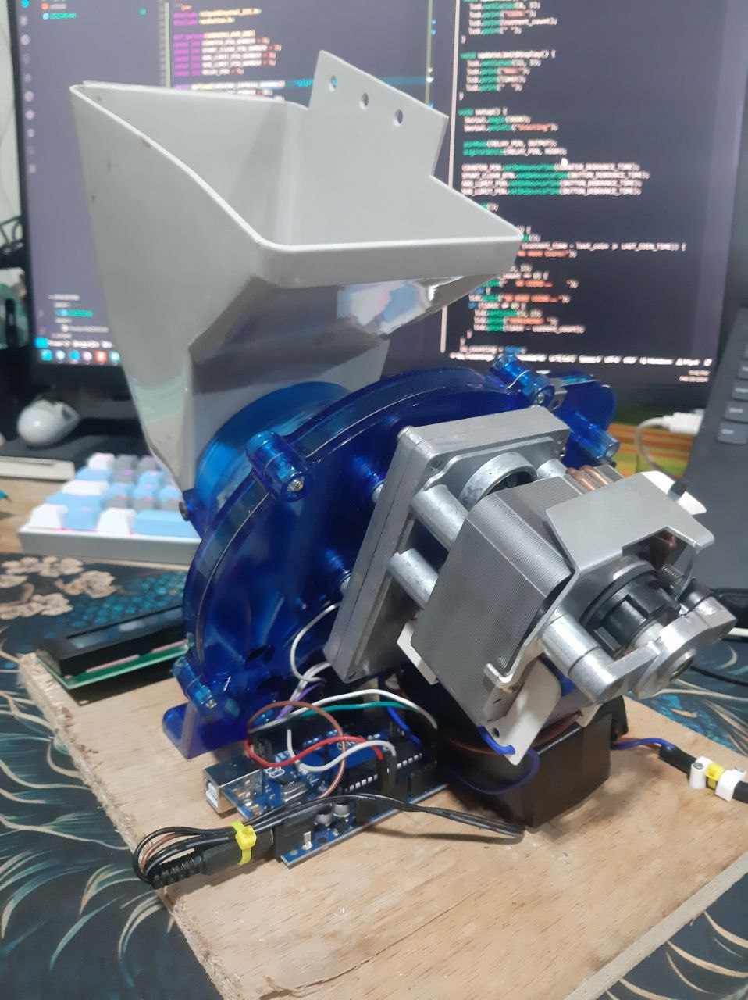

# Arduino-Coin-Counter

This Arduino Coin Counter project utilizes commonly available components to create a user-friendly coin counting system. By employing an Arduino Uno, ESP8266, or ESP32 micro controller, along with an LCD screen with I2C interface, three push buttons, a relay module, and resistors, you can efficiently count and manage coins. The system is designed to provide an intuitive interface for users to input and track their coin counts accurately. With clear instructions and easy-to-source materials, this project offers an accessible solution for hobbyists and enthusiasts interested in creating their own coin counting system.

### Materials:

- Coin Hopper with Sensor
- Arduino Uno / ESP8266 / ESP32
- LCD with I2C 20x4
- 3 Push Buttons
- Relay Module
- 230 ohms Resistor
- 6.8k ohms Resistor

## Libraries
- [LiquidCrystal_I2C](https://github.com/Jomelo/LCDMenuLib)
- [ezButton](https://arduinogetstarted.com/tutorials/arduino-button-library)


## Arduino Uno Schematics


## Project Images



## Code
```c++
#include <LiquidCrystal_I2C.h>
#include <ezButton.h>

#if defined(ARDUINO_AVR_UNO)
const int COUNTER_PIN_NUMBER = 6;
const int START_CLEAR_PIN_NUMBER = 2;
const int ADD_LIMIT_PIN_NUMBER = 3;
const int SUB_LIMIT_PIN_NUMBER = 4;
const int RELAY_PIN = 5;

#elif defined(ARDUINO_ESP8266_NODEMCU)
const int COUNTER_PIN_NUMBER = D2;
const int START_CLEAR_PIN_NUMBER = D3;
const int ADD_LIMIT_PIN_NUMBER = D4;
const int SUB_LIMIT_PIN_NUMBER = D5;
const int RELAY_PIN = D8;

#elif defined(ARDUINO_ESP32_DEV)
const int COUNTER_PIN_NUMBER = 13;
const int START_CLEAR_PIN_NUMBER = 14;
const int ADD_LIMIT_PIN_NUMBER = 15;
const int SUB_LIMIT_PIN_NUMBER = 16;
const int RELAY_PIN = 17;

#endif

const int LAST_COIN_TIME = 3000;
const int COUNTER_DEBOUNCE_TIME = 10;
const int BUTTON_DEBOUNCE_TIME = 25;

LiquidCrystal_I2C lcd(0x27, 20, 4);

ezButton COUNTER_PIN(COUNTER_PIN_NUMBER);
ezButton START_CLEAR_BTN(START_CLEAR_PIN_NUMBER);
ezButton ADD_LIMIT_PIN(ADD_LIMIT_PIN_NUMBER);
ezButton SUB_LIMIT_PIN(SUB_LIMIT_PIN_NUMBER);

int limit = 0;
int current_count = 0;
bool is_counting = false;
unsigned long last_coin = 0;
unsigned long current_time = 0;

void setupLCD() {
  lcd.init();
  lcd.backlight();
  lcd.setCursor(2, 0);
  lcd.print("AZK COIN COUNTER");
  updateLCD();
  updateLimitDisplay();
}

void updateLCD() {
  lcd.setCursor(0, 3);
  lcd.print("COIN:");
  lcd.print(current_count);
  lcd.print(" ");
}

void updateLimitDisplay() {
  lcd.setCursor(12, 3);
  lcd.print("MAX:");
  lcd.print(limit);
  lcd.print("  ");
}

void setup() {
  Serial.begin(9600);
  Serial.println("Starting");

  pinMode(RELAY_PIN, OUTPUT);
  digitalWrite(RELAY_PIN, HIGH);

  COUNTER_PIN.setDebounceTime(COUNTER_DEBOUNCE_TIME);
  START_CLEAR_BTN.setDebounceTime(BUTTON_DEBOUNCE_TIME);
  ADD_LIMIT_PIN.setDebounceTime(BUTTON_DEBOUNCE_TIME);
  SUB_LIMIT_PIN.setDebounceTime(BUTTON_DEBOUNCE_TIME);

  setupLCD();
}

void checkCoinCount() {
  current_time = millis();
  if (is_counting && (current_time - last_coin >= LAST_COIN_TIME)) {
    Serial.println("No more Coins!");

    lcd.setCursor(2, 1);
    if (current_count == 0) {
      lcd.print("   NO COINS...    ");
    } else {
      lcd.print("NO MORE COINS...");
      if (limit != 0) {
        lcd.setCursor(3, 2);
        lcd.print("REMAINING: ");
        lcd.print(limit - current_count);
      }
    }
    is_counting = false;
  }


  if (COUNTER_PIN.isPressed() && is_counting) {

    current_count++;
    updateLCD();
    if (limit == 0 || current_count <= (limit - 1)) {
      last_coin = current_time;

    } else {
      Serial.println(current_count);
      lcd.setCursor(3, 1);
      lcd.print("DONE COUNTING");
      is_counting = false;
      current_count = 0;
    }
    Serial.println(current_count);
  }
}

void updateCountState() {
  digitalWrite(RELAY_PIN, is_counting ? LOW : HIGH);
}

void adjustLimit() {
  if (ADD_LIMIT_PIN.isPressed() && limit < 5000) {
    int step = (limit >= 100) ? 100 : ((limit >= 50) ? 10 : 5);
    limit += step;
    Serial.print("Set limit: ");
    Serial.println(limit);
    updateLimitDisplay();
  }

  if (SUB_LIMIT_PIN.isPressed() && limit >= 5) {
    int step = (limit > 100) ? 100 : ((limit > 50) ? 10 : 5);
    limit -= step;
    Serial.print("Set limit: ");
    Serial.println(limit);
    updateLimitDisplay();

    if (limit == 0) {
      current_count = 0;
      updateLCD();
      lcd.setCursor(1, 1);
      lcd.print("   CLEARED COUNT   ");
      lcd.setCursor(2, 2);
      lcd.print("                ");
    }
  }
}

void handleStartClear() {
  if (START_CLEAR_BTN.isPressed()) {
    lcd.setCursor(2, 2);
    lcd.print("                ");
    if (current_count > limit && limit != 0) {
      updateLCD();
      lcd.setCursor(2, 1);
      lcd.print("MAX IS TOO LOW.. ");
      return;
    }

    if (current_count == limit && current_count != 0) {
      updateLCD();
      lcd.setCursor(2, 1);
      lcd.print("  COUNT DONE..");
      return;
    }

    Serial.println("Start / Clear pressed!");
    if (!is_counting) {
      is_counting = true;
      last_coin = current_time;
      Serial.println("Start counting");
      lcd.setCursor(2, 1);
      lcd.print("   COUNTING...  ");
    } else {
      is_counting = false;
      lcd.setCursor(2, 1);
      lcd.print("COUNTING STOPPED");
    }
  }
}

void loop() {
  COUNTER_PIN.loop();
  START_CLEAR_BTN.loop();
  ADD_LIMIT_PIN.loop();
  SUB_LIMIT_PIN.loop();


  updateCountState();
  checkCoinCount();
  adjustLimit();
  handleStartClear();
}

```
: )